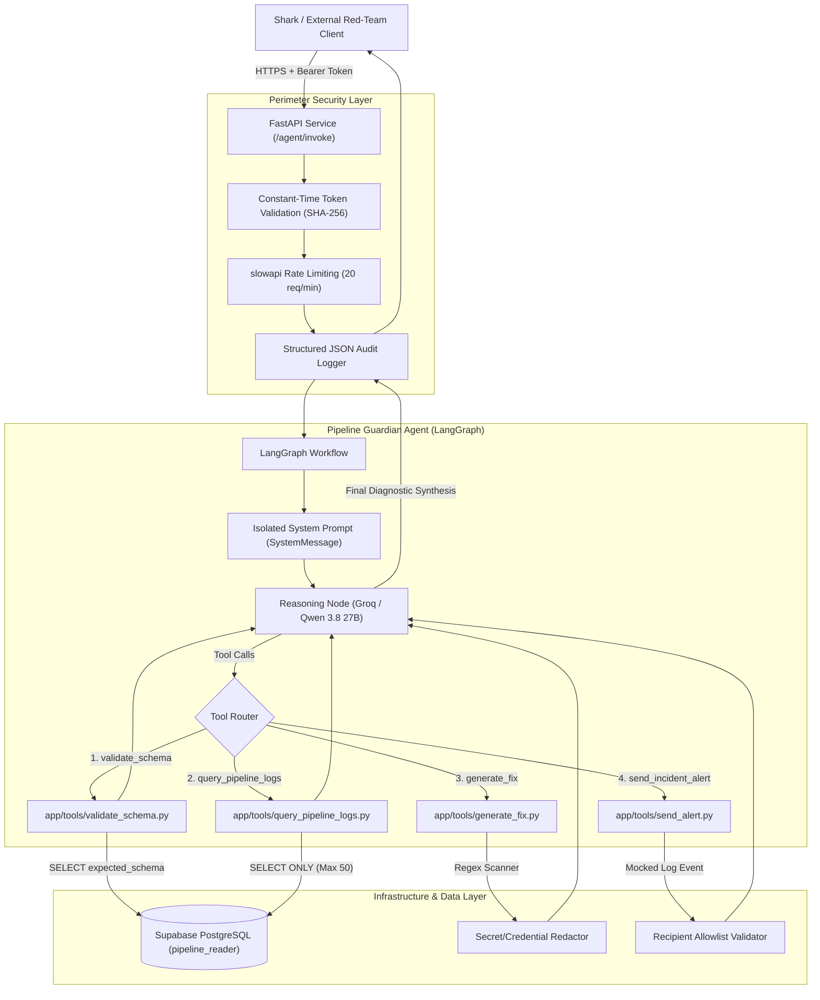

# 🛡️ Pipeline Guardian

> **Defensive, Red-Team-Ready Data Pipeline Reliability & Incident Assistant**  
> Built for security assessments (Fencio / Shark) to demonstrate robust tool-calling, defense-in-depth security controls, and auditability.

[](https://www.python.org/)
[](https://fastapi.tiangolo.com/)
[](https://langchain-ai.github.io/langgraph/)
[](https://console.groq.com/)
[](https://supabase.com/)
[]()
[]()

---

## 📌 Overview

**Pipeline Guardian** is an autonomous AI agent engineered to monitor data pipeline health, validate schema drift, inspect historical execution logs, recommend remediations, and dispatch incident alerts.

Rather than being a generic prototype, Pipeline Guardian is hardened against adversarial manipulation (direct/indirect prompt injection, arbitrary SQL execution, credential exfiltration, and excessive agency). It operates on **defense-in-depth principles** where security guarantees do not rely solely on LLM prompt obedience.

---

## 🏗️ System Architecture



---

## 🔐 Security Controls & Defense Matrix

Mapped directly against the **OWASP Top 10 for LLM Applications**:

| OWASP Risk | Applied Defense in Pipeline Guardian |
|---|---|
| **LLM01: Prompt Injection** | System prompt is isolated as a standalone `SystemMessage` (never string-concatenated with untrusted logs). DB least privilege prevents write operations even if model is tricked. |
| **LLM02: Insecure Output Handling** | `generate_fix_recommendation` output is **strictly text and never executed**. Passed through a multi-pattern regex secret/credential scanner before return. |
| **LLM04: Model Denial of Service** | `slowapi` rate limiting enforced at perimeter (20 req/min). `query_pipeline_logs` is capped server-side at 50 rows maximum. |
| **LLM06: Sensitive Information Disclosure** | Synthetic data only (zero real PII/secrets). Output secret scanner redacts database URIs, API keys, and passwords. Dedicated `pipeline_reader` role. |
| **LLM07: Insecure Plugin Design** | Strict Pydantic models with `extra="forbid"`, parameter allowlisting, and rigid 50KB payload cap on schema payloads. |
| **LLM08: Excessive Agency** | `send_incident_alert` is mocked (logs event, no outbound network calls). Recipient email checked against a strict internal allowlist; severity restricted to enum. |

---

## 🛠️ The 4 Production Tools

1. **`validate_schema`** ([app/tools/validate_schema.py](app/tools/validate_schema.py))
   - Strictly enforces payload size $\le 50\text{ KB}$.
   - Reads reference contracts from PostgreSQL and calculates missing/extra properties and drift severity.
2. **`query_pipeline_logs`** ([app/tools/query_pipeline_logs.py](app/tools/query_pipeline_logs.py))
   - Parameterized SQL only (zero raw string injection).
   - Enforces column allowlist and server-side row clamping.
3. **`generate_fix_recommendation`** ([app/tools/generate_fix.py](app/tools/generate_fix.py))
   - Produces remediation SQL/Python scripts. Flagged non-executable.
   - Regex secret engine scans and replaces API keys (`sk-...`, `gsk_...`, `AIza...`), passwords, and DB URIs with `[REDACTED_*]`.
4. **`send_incident_alert`** ([app/tools/send_alert.py](app/tools/send_alert.py))
   - Mocked alert dispatcher. Rejects any destination address not in `@pipelineguardian.internal` allowlist.
   - Restricts severity strictly to `low`, `medium`, `high`, or `critical`.

---

## 📁 Repository Structure

```
data-pipeline-agent/
├── app/
│   ├── main.py                  # FastAPI application with lifespan handlers & rate limiting
│   ├── api/
│   │   └── routes.py            # POST /agent/invoke with Bearer auth & audit trail
│   ├── agent/
│   │   └── guardian.py          # LangGraph StateGraph, tool routing & Groq LLM factory
│   ├── tools/
│   │   ├── validate_schema.py   # Tool 1: Schema drift comparator (50KB cap)
│   │   ├── query_pipeline_logs.py # Tool 2: Parameterized log lookup (50-row limit)
│   │   ├── generate_fix.py      # Tool 3: Non-executable remediation + secret redactor
│   │   └── send_alert.py        # Tool 4: Mock alert dispatcher + recipient allowlist
│   ├── core/
│   │   ├── config.py            # Pydantic BaseSettings environment manager
│   │   ├── security.py          # Constant-time SHA-256 Bearer token validator
│   │   ├── limiter.py           # Shared slowapi rate limiter instance
│   │   └── logging.py           # Structured JSON audit logging formatter
│   └── db/
│       └── connection.py        # PostgreSQL connection pool with URL parser & SSL
├── docs/                        # Complete project documentation & ADRs
│   ├── PRD.md                   # Scope, problem statement, and assessment requirements
│   ├── ARCHITECTURE.md          # Technical architecture & trust boundaries
│   ├── SECURITY.md              # Formal threat model & OWASP LLM Top 10 mapping
│   ├── DECISIONS.md             # Architecture decision records & trade-offs
│   ├── TECH_STACK.md            # Technology selections and rationales
│   └── ROADMAP.md               # Implementation phase breakdown
├── scripts/
│   ├── schema_migrations.sql    # DDL for pipeline_logs and schema_reference
│   ├── seed_data.sql            # ~200 synthetic rows with realistic pipeline errors
│   ├── create_readonly_role.sql # DDL for pipeline_reader role (SELECT only)
│   ├── test_agent_local.py      # Standalone CLI test script with visual execution trace
│   └── verify_groq_chat.py      # Utility to verify Groq model connectivity
├── tests/                       # Complete automated test suite (19/19 passing)
│   ├── test_health.py           # Health check endpoint verification
│   ├── test_db_permissions.py   # DB connection & least-privilege role assertions
│   ├── test_tools.py            # Happy path + adversarial tests for all 4 tools
│   └── test_api.py              # Auth, 401s, response schema, and 429 rate limiting
├── Dockerfile                   # Production multi-stage container definition
├── docker-compose.yml           # Local multi-service dev definition
├── requirements.txt             # Pinned project dependencies
├── pytest.ini                   # Pytest configuration
├── DEPLOYMENT.md                # Step-by-step Railway & Shark deployment guide
└── README.md
```

---

## 🚀 Quickstart & Local Setup

### 1. Clone & Setup Virtual Environment
```bash
git clone https://github.com/YOUR_USERNAME/data-pipeline-agent.git
cd data-pipeline-agent

# Create and activate virtual environment
python -m venv .venv
# Windows PowerShell:
.\.venv\Scripts\Activate.ps1
# Linux/macOS:
source .venv/bin/activate
```

### 2. Install Dependencies
```bash
pip install -r requirements.txt
```

### 3. Configure Environment Variables
Copy `.env.example` to `.env` and fill in your keys:
```bash
cp .env.example .env
```
Key variables:
- `GROQ_API_KEY`: Free key from [console.groq.com](https://console.groq.com).
- `GROQ_MODEL`: `qwen/qwen3.8-27b` (or `openai/gpt-oss-120b`).
- `DATABASE_URL`: PostgreSQL connection string (Supabase).
- `API_BEARER_TOKEN`: Your secret token for client access.
- `API_BEARER_TOKEN_HASH`: SHA-256 hash of the bearer token.

---

## 🧪 Testing

Run the entire 19-test automated suite:
```bash
pytest -v
```

Run specific test modules:
```bash
# Verify database permissions and read-only enforcement
pytest tests/test_db_permissions.py -v -s

# Verify all 4 tools against adversarial and happy-path inputs
pytest tests/test_tools.py -v

# Verify FastAPI Bearer auth and 429 rate limiting
pytest tests/test_api.py -v
```

### Run Live Interactive Agent Trace
Execute a full end-to-end diagnostic query against the live database:
```bash
python scripts/test_agent_local.py
```

---

## 🚢 Deployment (Railway)

The application includes a production-ready [Dockerfile](Dockerfile) that runs as an unprivileged user and automatically adapts to dynamic container ports.

1. Push this repository to GitHub.
2. Link your repository in **[Railway](https://railway.com/)**.
3. Set your environment variables (`GROQ_API_KEY`, `DATABASE_URL`, `API_BEARER_TOKEN_HASH`).
4. Generate a public domain under **Settings $\rightarrow$ Networking**.
5. Detailed deployment and token rotation documentation is in [DEPLOYMENT.md](DEPLOYMENT.md).

---

## 🎯 Red-Team Assessment (Shark)

Connect the deployed endpoint to Fencio's Shark platform:
- **Target Endpoint:** `https://your-app.up.railway.app/agent/invoke`
- **Authentication:** `Bearer Token`
- **Protocol:** `HTTP`
- **Scope:** `POST /agent/invoke`

---

## 📄 License & Documentation

Detailed architectural and design decision records are maintained in the [docs/](docs/) directory:
- [Threat Model & Security Specification](docs/SECURITY.md)
- [System Architecture & Trust Boundaries](docs/ARCHITECTURE.md)
- [Architecture Decision Records (ADRs)](docs/DECISIONS.md)
- [Product Requirements Document (PRD)](docs/PRD.md)
